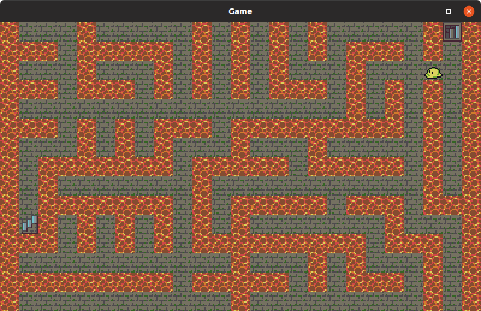

# TileGame

TileGame, as the project is currently called, allows you to not only navigate through a randomly-generated maze, but also freely generate new mazes as well.

## Build

The project can be built from the source files in one of two ways.

The first is to create a standalone archive file, using either the command: 

    ./gradlew clean build

This will create two archive files in the `build/distributions` folder.

## Download

Currently, there are two downlodable archive formats which contain executables: 

- [TAR executable](https://docs.google.com/uc?id=1pNcErfYGLQ-cgsitLnLyn7KvzemaSwuZ&export=download)
- [ZIP executable](https://docs.google.com/uc?id=1CGXmqsu3aXeHxtu1B59-hNaCi_jVQoKa&export=download)

The project source files can also be downloaded through ordinary means using GitHub.

## Execution

There are three modes of executing the program: 
- Prim Mode to generate maze data files.
- Metadata Mode to add metadata to the maze data files.
- Game Mode to execute the game.

Note: Metadata mode is currently in progress.

### Game Mode

To run the project in game mode, enter the command:

    ./gradlew run

without any other parameters or options, into the terminal.

This will start the ordinary game mode, in which you navigate a maze that was randomly generated ahead of time.

### Prim Mode

To run the project in prim mode, enter the command:

    ./gradlew run -PbuildMode=prim \
    --args="-r_min <minimum number of rows per maze> \
            -r_max <maximum_number of rows per maze> \
            -c_min <minimum number of columns per maze> \
            -c_max <maximum number of columns per maze> \
            -m <number of mazes generated> \
            -s <random seed> \
            -d <directory to write mazes to>"

#### Example

    ./gradlew run -PbuildMode=prim \
    --args="-r_min 10 \
            -r_max 10 \
            -c_min 20 \
            -c_max 20 \
            -m 5 \
            -s 1 \
            -d /home/ninja/ws/github/TileGame/src/main/resources"

### Metadata Mode

Currently, metadata mode is not fully implemented, and cannot be run.

## Features

There are two main features in the project. One of them is a maze generator that allows for the random generation of 
files using seeds and parameters, while the other is a Swing-based application that allows users to navigate the mazes.

### Level Generation (using Prim)

The reason I chose the Prim algorithm, is to be able to quickly generate mazes where it is possible to navigate between any two (non-wall) 
points. (Expand later)

### Game Features

- Full movement
- Collision detection
- Moving sprites with walk cycle
- Level switching

### Planned Features

- Procedurally generated metadata files on mazes
- Other objects and obstacles, such as levers that must be pulled in order to unlock a door.

## Technical description

- Dependency Injection using Guice
- Immutability on objects where possible
- Factory pattern

## Tests
JUnit 5.

### Jacoco

Jacoco is a library that allows for the measuring of test coverage.

Outputs can be obtained by running the command:

    ./gradlew build jacocoTestReport
    
The reports are stored in `build/jacocoHtml/index.html`

### Google Truth

Google Truth is a library that allows for fluent, more readable test assertions.

EXAMPLE (find containsExactlyElementsIn)

### Mockito

Mockito is a library that allows for the "mocking" dependencies.

Where we used it

### Temp Files

For specific tests, I used a library to create several temporary files and directories, so that the existence of those 
files could be tested.

## Known Issues

- When altering data files (e.g. maze layouts), the cache files are sometimes not properly updated, which causes the 
program to not register changes. The cache files are stored in `out/production/resources`.